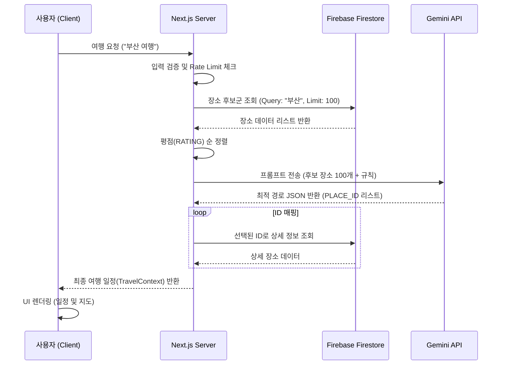

# TourApp 프로세스 정의서 (Process Definition Document)

## 1. 개요 (Overview)

본 문서는 **TourApp**의 핵심 기능인 'AI 기반 여행 일정 생성' 및 관련 프로세스의 흐름을 정의합니다. 사용자의 자연어 요청을 분석하여 최적의 여행 경로를 생성하고, 이를 시각적으로 제공하는 전체 과정을 기술합니다.

---

## 2. 시스템 아키텍처 (System Architecture)

- **Frontend**: Next.js (React) - 사용자 인터페이스 및 상호작용 담당
- **Backend**: Next.js Server Actions - 비즈니스 로직 및 API 통신 담당
- **Database**: Firebase Firestore - 장소 데이터(PLACES) 및 사용자 정보 저장
- **AI Engine**: Google Gemini API - 여행 컨텍스트 분석 및 경로 최적화 (Route Sorting)

---

## 3. 핵심 프로세스 (Core Processes)

### 3.1. 여행 일정 생성 프로세스 (Travel Plan Generation)

사용자가 "부산 1박 2일 힐링 여행"과 같은 요청을 입력했을 때의 처리 과정입니다.

#### **Step 1: 사용자 요청 및 검증 (User Request & Validation)**

1.  **사용자 입력 (User Input)**

    - 메인 화면의 대형 입력창을 통해 자연어 형태의 여행 니즈를 수집합니다. (예: "아이와 함께하는 제주도 2박 3일 여행")

2.  **입력 데이터 정제 및 보안 (Input Sanitization & Security)**

    - **통합 정제 로직 (`sanitizeInput`)**:
      - **Trim & Normalize**: 앞뒤 공백 제거 및 연속된 공백을 단일 공백으로 치환.
      - **Special Char Removal**: 해킹 시도 등 비정상적인 특수문자(`<>`, `script`, `alert` 등)를 정규식(Regex)으로 필터링하여 **XSS(Cross-Site Scripting)** 공격을 원천 차단.
    - **길이 검증 (Length Validation)**: 2자 이상 50자 이하의 입력만 허용하여 불필요한 서버 리소스 낭비 방지.

3.  **트래픽 제어 (Traffic Control)**

    - **Rate Limiting**: 동일 IP 기준 **분당 5회**로 요청을 제한하여 DDoS 공격 및 비용 폭발을 방지 (Redis 기반 Sliding Window 알고리즘 적용).

4.  **피드백 UX (Error Feedback)**
    - 검증 실패 시, 토스트 메시지(Toast)와 입력창 진동(Shake Animation) 효과를 통해 사용자에게 즉각적이고 직관적인 피드백 제공.

#### **Step 2: 장소 후보군 확보 (Fetching Candidates)**

1.  **키워드 및 의도 추출 (Keyword & Intent Extraction)**

    - 단순 목적지 추출뿐만 아니라, '힐링', '아이와 함께'와 같은 **테마 키워드**를 함께 추출하여 쿼리 정확도를 높입니다.

2.  **하이브리드 쿼리 실행 (Hybrid Query Execution)**

    - **Spatial filtering**: 목적지(행정구역) 기반으로 `ADDRESS` 필드를 `startAt` 쿼리하여 1차 후보군을 확보합니다.
    - **Semantic Filtering**: 추출된 테마 키워드가 `TAGS` 배열에 포함된 장소를 우선적으로 탐색합니다.

3.  **데이터 최적화 및 경량화 (Data Optimization for AI)**

    - **Token Optimization**: AI에게 전달할 프롬프트(Context) 크기를 줄이기 위해, 불필요한 필드(상세 설명, 이미지 URL 등)를 제거합니다.
    - **Essential Fields Only**: AI 판단에 필수적인 핵심 필드(`ID`, `NAME`, `CATEGORY`, `LAT/LNG`, `TAGS`, `RATING`)만 추출하여 JSON 객체를 경량화합니다.

4.  **다양성 보장 및 예외 처리 (Diversity Assurance & Fallback)**
    - **Category Quota**: 특정 카테고리(예: 카페)에만 편중되지 않도록 식당/관광지/숙소의 비율을 조정하여 후보군을 구성합니다.
    - **Fallback Strategy**: 검색 결과가 20개 미만으로 부족할 경우, 해당 지역의 **'인기 장소(Top Rated)'**를 자동으로 추가하여 AI가 충분한 선택지를 가지도록 보장합니다.

#### **Step 3: AI 기반 경로 생성 (AI Route Generation) (핵심 프로세스)**

이 단계는 **Gemini 2.5 Flash** 모델이 "여행 전문가" 페르소나를 수행하여, 비정형의 장소 데이터들을 시공간적으로 완벽한 여행 일정으로 조립하는 과정입니다.

1.  **프롬프트 엔지니어링 전략 (Prompt Engineering Strategy)**

    - **System Instruction (페르소나 부여)**: "너는 최고의 여행 경로 최적화 전문가(Route Optimization Agent)이다. 주어진 장소 후보군(Candidate Pool) 내에서만 선택하여, 사용자 요청에 가장 부합하고 물리적으로 이동 가능한 최적의 코스를 설계하라."
    - **Constraint Injection (제약 조건 주입)**:
      - **Hard Constraints**: "하루에 식사는 점심/저녁 2회 필수", "숙소는 지정된 곳에서만 머물 것", "총 이동 시간은 하루 3시간을 넘지 말 것".
      - **Soft Constraints**: "힐링 테마이므로 여유로운 일정 선호", "동선이 꼬이지 않도록 클러스터링 기반 정렬".
    - **Output Schema Enforcement**: 결과를 반드시 지정된 JSON 포맷(`RouteResponse` 타입)으로만 출력하도록 강제하여, 파싱 에러(Parsing Error)를 최소화합니다.

2.  **컨텍스트 구성 및 최적화 (Context Construction)**

    - **Lightweight JSON Context**: 장소 데이터를 최소화된 JSON 포맷(ID, 위경도, 카테고리, 태그, 평점)으로 변환하여 토큰 비용을 절감합니다.
    - **User Persona Embedding**: "아이 동반", "커플 여행" 등 사용자의 여행 성향(Persona)을 프롬프트 상단에 명시하여, AI가 장소 선정 시 가중치를 두도록 유도합니다.

3.  **알고리즘적 추론 과정 (Algorithmic Reasoning)**

    - AI는 내부적으로 다음의 단계를 거쳐 경로를 생성합니다:
    - **Clustering (권역 구분)**: 후보 장소들의 위경도를 분석하여 지리적으로 인접한 그룹(Cluster)을 형성하고, 이를 일자 별(Day 1, Day 2...)로 할당합니다.
    - **Anchor Point Setting (앵커 설정)**: 각 클러스터 내에서 중심이 되는 숙소(Stay)나 랜드마크를 기준점(Anchor)으로 설정합니다.
    - **TSP Simulation (경로 최적화)**: 앵커 점을 기준으로 '서쪽에서 동쪽으로' 또는 '시계 방향으로' 이동하는 최단 경로(TSP)를 시뮬레이션하여 순서를 정렬합니다.

4.  **모델 파라미터 및 실행 (Model Execution)**

    - **Target Model**: `gemini-2.5-flash` (속도와 추론 능력의 최적 밸런스).
    - **Configuration**:
      - `temperature`: **0.2** (창의성보다는 일관성 있고 논리적인 경로 생성을 위해 낮게 설정).
      - `top_p`: **0.8** (지나치게 엉뚱한 장소 추천 방지).
      - `max_tokens`: **4096** (긴 일정 생성 대응).

5.  **결과 검증 및 복구 (Output Validation & Repair)**
    - **JSON Parsing**: 응답받은 문자열을 JSON으로 파싱합니다. 실패 시 `Thinking Block` 제거 후 재시도합니다.
    - **Hallucination Check**: 반환된 `PLACE_ID`가 실제 Step 2의 후보군(Input Context)에 존재하는지 전수 검사합니다. 존재하지 않는 ID(환각)는 즉시 폐기하고 예비 장소로 대체합니다.

#### **Step 4: 데이터 매핑 및 결과 반환 (Data Mapping & Response)**

AI가 생성한 'ID 리스트'를 실제 앱에서 사용 가능한 '풍부한 데이터 객체'로 변환하는 단계입니다.

1.  **데이터 하이드레이션 (Data Hydration)**

    - **ID-to-Object Mapping**: AI가 반환한 경량화된 `PLACE_ID` 리스트를 Step 2에서 확보한 인메모리 캐시(Cache)와 매핑하여 원본 상세 정보(이미지 URL, 주소, 상세 설명 등)를 즉시 복원합니다.
    - **Missing Data Fallback**: 만약 캐시에 없는 ID가 발견될 경우(매우 드묾), 비동기로 Firebase 단건 조회를 수행하여 결손 데이터를 채워 넣습니다.

2.  **지능형 시간 할당 (Intelligent Time Allocation)**

    - 단순 나열된 장소들에 현실적인 **타임테이블(Time Table)**을 부여합니다.
    - **Category-based Duration**: 장소 유형별 평균 체류 시간을 자동 할당합니다. (예: 카페=1시간, 식당=1.5시간, 테마파크=3시간)
    - **Travel Time Calculation**: 장소 간 이동 거리를 기반으로 이동 시간을 계산하여, 다음 장소의 도착 예정 시간을 산출합니다.

3.  **최종 응답 객체 조립 (Response Assembly)**
    - 클라이언트(Frontend)가 별도의 가공 없이 즉시 렌더링할 수 있도록 최적화된 `TravelContext` 객체를 생성하여 반환합니다.

#### **Step 5: 초개인화 UI 렌더링 (State-of-the-Art UI Rendering)**

사용자에게 여행 계획이 완성되는 과정을 시각적 감동으로 전달하는 최종 단계입니다.

1.  **스트리밍 및 점진적 렌더링 (Streaming & Progressive Rendering)**

    - **Skeleton UI**: 데이터 수신 대기 시간 동안, 스켈레톤 UI를 노출하여 체감 로딩 속도를 줄입니다.
    - **Streaming Response**: AI 생성 과정이 길어질 경우, 완료된 일차(Day 1)부터 순차적으로 클라이언트에 전송하여 사용자가 먼저 내용을 확인할 수 있게 합니다.

2.  **인터랙티브 타임라인 시각화 (Interactive Timeline Visualization)**

    - **Vertical Scroller**: 모바일 경험에 최적화된 수직형 타임라인으로 일정을 렌더링합니다.
    - **Dynamic Map Markers**: 타임라인 스크롤 위치에 따라 지도 상의 마커가 자동으로 포커싱(Auto-Focus)되고 활성화(Active State)되는 양방향 동기화(Two-way Binding)를 구현합니다.

3.  **Client-Side State Management (클라이언트 상태 관리)**
    - 전송받은 `TravelContext`는 단순히 정적인 데이터가 아니라, 사용자가 드래그 앤 드롭으로 순서를 바꾸거나 삭제할 수 있는 **Reactive State**로 관리되어 즉각적인 UI 반응성을 보장합니다.

---

### 3.2. 장소 대체 프로세스 (Place Replacement)

사용자가 생성된 일정의 특정 장소를 다른 장소로 변경하는 과정입니다.

1. **대체 요청**: 사용자가 특정 장소의 '교체' 버튼 클릭.
2. **모달 실행**: `PlaceReplacementModal` 오픈.
3. **대체 장소 검색**:
   - 현재 장소와 동일한 지역/카테고리의 다른 장소들을 Firebase에서 검색.
   - 또는 사용자가 직접 키워드로 검색.
4. **장소 선택 및 반영**:
   - 사용자가 새 장소 선택 시, 기존 `PlanItem`을 새 장소 데이터로 교체.
   - 전체 일정 상태(State) 업데이트 및 지도 다시 그리기.

---

## 4. 데이터 흐름도 (Data Flow Diagram)

## 5. 주요 데이터 구조 (Key Data Structures)

### Firebase Place (DB)

- `PLACE_ID`: 고유 식별자
- `NAME`: 장소명
- `ADDRESS`: 주소
- `CATEGORY`: { main, sub }
- `LOC_LAT`, `LOC_LNG`: 좌표
- `RATING`: 평점
- `TAGS`: 태그 정보

### Plan Item (Frontend)

- `day`: 할당된 일차 (1, 2...)
- `time`: 방문 예정 시간
- `type`: 장소 유형 (food, cafe, stay, sightseeing)
- `isLocked`: 사용자가 고정한 장소 여부
