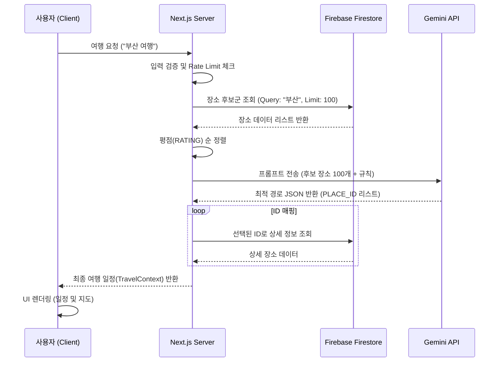

# TourApp 프로세스 정의서 (Process Definition Document)

## 1. 개요 (Overview)

본 문서는 **TourApp**의 핵심 기능인 'AI 기반 여행 일정 생성' 및 관련 프로세스의 흐름을 정의합니다. 사용자의 자연어 요청을 분석하여 최적의 여행 경로를 생성하고, 이를 시각적으로 제공하는 전체 과정을 기술합니다.

---

## 2. 시스템 아키텍처 (System Architecture)

- **Frontend**: Next.js (React) - 사용자 인터페이스 및 상호작용 담당
- **Backend**: Next.js Server Actions - 비즈니스 로직 및 API 통신 담당
- **Database**: Firebase Firestore - 장소 데이터(PLACES) 및 사용자 정보 저장
- **AI Engine**: Google Gemini API - 여행 컨텍스트 분석 및 경로 최적화 (Route Sorting)

---

## 3. 핵심 프로세스 (Core Processes)

### 3.1. 여행 일정 생성 프로세스 (Travel Plan Generation)

사용자가 "부산 1박 2일 힐링 여행"과 같은 요청을 입력했을 때의 처리 과정입니다.

#### **Step 1: 사용자 요청 및 검증 (User Request & Validation)**

1. **사용자 입력**: 메인 화면에서 자연어 검색어 입력.
2. **유효성 검사 (`extractTravelContext`)**:
   - 입력 길이 제한 (50자 이내) 확인.
   - XSS 공격 방지(스크립트 태그 필터링).
   - **Rate Limiting**: IP 기반 요청 횟수 제한 (1분당 5회) 확인.

#### **Step 2: 장소 후보군 확보 (Fetching Candidates)**

1. **키워드 추출**: 사용자 입력의 첫 단어를 목적지(Destination)로 간주 (예: "부산").
2. **Firebase 조회**:
   - `PLACES` 컬렉션에서 주소(ADDRESS)가 목적지로 시작하는 장소 검색.
   - **최대 100개**의 장소 데이터를 조회.
3. **인메모리 정렬**:
   - 조회된 장소들을 **평점(RATING) 내림차순**으로 정렬하여 상위 100개 선정.
   - _목적: AI에게 양질의 데이터를 우선적으로 제공하기 위함._

#### **Step 3: AI 기반 경로 생성 (AI Route Generation)**

1. **프롬프트 구성**:
   - 역할 부여: "Route Sorter" (장소 선정 및 경로 정렬 전문가).
   - 컨텍스트 제공: Step 2에서 확보한 100개의 후보 장소 리스트 (ID, 이름, 위치, 카테고리, 태그, 평점 포함).
   - 제약 조건 명시:
     - **숙소 앵커링**: Day N의 마지막 장소는 숙소, Day N+1의 시작은 동일 숙소.
     - **동선 최적화**: 거리 기반 정렬 (서→동, 권역별).
     - **출력 형식**: JSON (일차별 `PLACE_ID` 배열).
2. **Gemini API 호출**:
   - `gemini-2.5-flash-lite` 모델 사용.
   - **재시도 로직(Retry Logic)**: `503 Service Unavailable` 등 일시적 오류 발생 시 최대 3회 재시도 (Exponential Backoff).

#### **Step 4: 데이터 매핑 및 결과 반환 (Data Mapping & Response)**

1. **응답 파싱**: Gemini가 반환한 JSON에서 `route_ids` 추출.
2. **상세 정보 매핑**:
   - 추출된 `PLACE_ID`를 사용하여 Firebase에서 다시 상세 정보를 조회 (또는 캐시된 데이터 사용).
   - `PlanItem` 형식으로 변환 (시간 할당, 타입 분류 등).
3. **결과 반환**: 완성된 `TravelContext` 객체를 클라이언트로 전달.

#### **Step 5: UI 렌더링 (UI Rendering)**

1. **결과 페이지 이동**: `/planner` 페이지로 라우팅.
2. **일정 표시**:
   - `DayItems` 컴포넌트를 통해 일차별 장소 리스트 렌더링.
   - 지도(`Map.tsx`)에 마커 및 경로 표시.

---

### 3.2. 장소 대체 프로세스 (Place Replacement)

사용자가 생성된 일정의 특정 장소를 다른 장소로 변경하는 과정입니다.

1. **대체 요청**: 사용자가 특정 장소의 '교체' 버튼 클릭.
2. **모달 실행**: `PlaceReplacementModal` 오픈.
3. **대체 장소 검색**:
   - 현재 장소와 동일한 지역/카테고리의 다른 장소들을 Firebase에서 검색.
   - 또는 사용자가 직접 키워드로 검색.
4. **장소 선택 및 반영**:
   - 사용자가 새 장소 선택 시, 기존 `PlanItem`을 새 장소 데이터로 교체.
   - 전체 일정 상태(State) 업데이트 및 지도 다시 그리기.

---

## 4. 데이터 흐름도 (Data Flow Diagram)

## 5. 주요 데이터 구조 (Key Data Structures)

### Firebase Place (DB)

- `PLACE_ID`: 고유 식별자
- `NAME`: 장소명
- `ADDRESS`: 주소
- `CATEGORY`: { main, sub }
- `LOC_LAT`, `LOC_LNG`: 좌표
- `RATING`: 평점
- `TAGS`: 태그 정보

### Plan Item (Frontend)

- `day`: 할당된 일차 (1, 2...)
- `time`: 방문 예정 시간
- `type`: 장소 유형 (food, cafe, stay, sightseeing)
- `isLocked`: 사용자가 고정한 장소 여부
