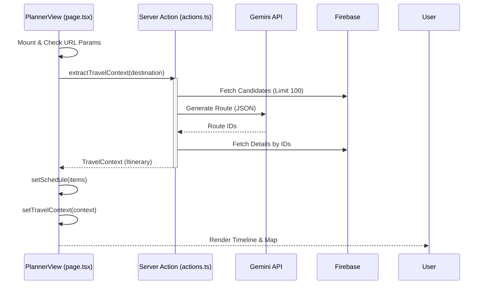

# TourApp 코드 기술 정의서 (Code Technical Definition Document)

## 1. 기술 스택 (Technology Stack)

### 1.1. Core Framework

- **Next.js 14+ (App Router)**: 서버 사이드 렌더링(SSR) 및 서버 액션(Server Actions) 활용.
- **React 18**: 컴포넌트 기반 UI 개발.
- **TypeScript**: 정적 타입 시스템을 통한 안정성 확보.

### 1.2. Database & Backend

- **Firebase Firestore**: NoSQL 기반의 실시간 데이터베이스. 장소 데이터 및 사용자 정보 관리.
- **Next.js Server Actions**: 백엔드 API 별도 구축 없이 서버 로직 직접 실행 (`src/lib/actions.ts`).

### 1.3. AI Engine

- **Google Gemini API**: `gemini-2.5-flash-lite` 모델 사용. 자연어 처리 및 경로 최적화 수행.

### 1.4. Styling

- **SCSS (Sass)**:
  - `src/styles/style.scss`: 전역 스타일 및 컴포넌트 스타일 통합 관리.
  - `src/styles/_variables.scss`: 색상, 폰트, z-index 등 디자인 토큰 관리.
  - `src/styles/_mixins.scss`: 반응형(Mobile/Desktop), 유틸리티 믹스인 정의.
- **Tailwind CSS**: 일부 유틸리티 클래스 사용 (점진적으로 SCSS로 마이그레이션 중).

### 1.5. State Management

- **React Hooks**: `useState`, `useEffect`, `useRef` 등 기본 훅 사용.
- **URL Search Params**: 검색어, 필터 등 페이지 간 상태 공유에 활용.
- **Zustand (Optional)**: `usePlannerStore`를 통한 전역 상태 관리 (Destination, DateRange 등).

---

## 2. 프로젝트 구조 (Directory Structure)

```
src/
├── app/                 # Next.js App Router
│   ├── (pages)/         # 라우트 그룹
│   │   └── planner/     # 플래너 페이지 (/planner)
│   │       └── page.tsx # 메인 컨트롤러 (PlannerView)
│   ├── layout.tsx       # 전역 레이아웃
│   └── page.tsx         # 메인 홈 페이지
├── components/          # UI 컴포넌트
│   ├── planner/         # 플래너 전용 컴포넌트
│   │   ├── PlannerTimeline.tsx # 타임라인 뷰
│   │   ├── PlannerModals.tsx   # 모달 관리자
│   │   ├── DayItems.tsx        # 개별 일정 아이템
│   │   ├── Map.tsx             # 지도 시각화
│   │   └── PlaceReplacementModal.tsx # 장소 대체 모달
│   └── ...
├── lib/                 # 비즈니스 로직
│   ├── actions.ts       # Server Actions (AI, DB)
│   └── ...
└── ...
```

---

## 3. 주요 모듈 및 함수 상세 (Key Modules & Functions Detail)

### 3.1. `src/lib/actions.ts` (Core Business Logic)

서버 사이드에서 실행되는 핵심 비즈니스 로직을 담당합니다.

| 함수명                     | 인자 (Arguments)                         | 설명 및 주요 로직                                                                                                                                                                                                                                                       |
| :------------------------- | :--------------------------------------- | :---------------------------------------------------------------------------------------------------------------------------------------------------------------------------------------------------------------------------------------------------------------------- |
| **`extractTravelContext`** | `userQuery: string` (사용자 입력 검색어) | **사용자 요청 분석 및 AI 경로 생성**<br>1. 입력값 검증 (길이, XSS) 및 Rate Limit 체크<br>2. Firebase에서 목적지 키워드로 장소 후보군 조회 (Limit 100)<br>3. 후보군을 평점(RATING)순 정렬<br>4. Gemini API 호출 (Retry 로직 포함)<br>5. 결과 JSON 파싱 및 상세 정보 매핑 |
| **`getTravelPlan`**        | `destination: string` (여행지 지역명)    | **(Legacy) 단순 장소 조회**<br>목적지 키워드로 장소를 단순 검색하여 반환 (AI 미사용 시 Fallback).                                                                                                                                                                       |
| **`checkRateLimit`**       | `ip: string` (클라이언트 IP)             | **API 요청 제한 (Rate Limiting)**<br>Firestore `rate_limits` 컬렉션을 사용하여 IP당 1분 5회 제한 적용.                                                                                                                                                                  |
| **`getPlacesByNames`**     | `names: string[]` (장소명 배열)          | **이름 기반 장소 일괄 조회**<br>장소 이름 배열을 받아 Firestore `in` 쿼리로 일괄 조회 (Chunk 단위 처리).                                                                                                                                                                |
| **`getPlacesByIds`**       | `ids: string[]` (장소 ID 배열)           | **ID 기반 장소 일괄 조회**<br>`PLACE_ID` 배열을 받아 Firestore에서 상세 정보 조회.                                                                                                                                                                                      |

### 3.2. `src/components/planner/DayItems.tsx` (Planner UI Component)

여행 일정의 개별 아이템(카드)을 렌더링하고 상호작용을 처리합니다.

| 함수명/컴포넌트       | 인자 (Props)                                                                                                                                                                                                                                                     | 설명 및 주요 로직                                                                                                                                     |
| :-------------------- | :--------------------------------------------------------------------------------------------------------------------------------------------------------------------------------------------------------------------------------------------------------------- | :---------------------------------------------------------------------------------------------------------------------------------------------------- |
| **`DayItems`**        | `item`: PlanItem (일정 데이터)<br>`index`: number (순서)<br>`selected`: boolean (선택 여부)<br>`onClick`: function (클릭 핸들러)<br>`onReplaceClick`: function (교체 핸들러)<br>`onLockClick`: function (잠금 핸들러)<br>`onDeleteClick`: function (삭제 핸들러) | **개별 일정 카드 렌더링**<br>- `item` 데이터를 기반으로 카드 UI 표시<br>- 선택 상태(`selected`)에 따라 확장된 뷰 표시<br>- 드래그 앤 드롭 핸들러 연결 |
| **`handleCardClick`** | 없음                                                                                                                                                                                                                                                             | **카드 선택 처리**<br>미선택 상태면 선택(`onClick`), 이미 선택 상태면 상세 팝업 오픈(`setIsDetailPopupOpen`).                                         |

### 3.3. `src/components/planner/Map.tsx` (Map Visualization)

네이버 지도를 사용하여 경로와 마커를 시각화합니다.

| 함수명/컴포넌트 | 인자 (Props)                                                                                                                                                           | 설명 및 주요 로직                                                                                                                                                                                                                                        |
| :-------------- | :--------------------------------------------------------------------------------------------------------------------------------------------------------------------- | :------------------------------------------------------------------------------------------------------------------------------------------------------------------------------------------------------------------------------------------------------- |
| **`Map`**       | `schedule`: PlanItem[] (전체 일정)<br>`selectedDay`: number (선택된 일차)<br>`selectedItemId`: string (선택된 아이템 ID)<br>`onItemClick`: function (마커 클릭 핸들러) | **지도 렌더링 및 마커 표시**<br>1. `selectedDay`에 해당하는 아이템 필터링<br>2. 네이버 지도 인스턴스 생성 (또는 재사용)<br>3. 마커 생성 및 클릭 이벤트(`onItemClick`) 바인딩<br>4. 경로(Polyline) 그리기<br>5. 뷰포트 자동 조정 (`fitBounds` or `morph`) |

### 3.4. `src/lib/mappers.ts` (Data Transformation)

데이터 모델 간의 변환을 담당합니다.

| 함수명                   | 인자 (Arguments)                                                                         | 설명 및 주요 로직                                                                                                                                                                     |
| :----------------------- | :--------------------------------------------------------------------------------------- | :------------------------------------------------------------------------------------------------------------------------------------------------------------------------------------ |
| **`mapPlaceToPlanItem`** | `place`: FirebasePlace (DB 데이터)<br>`day`: number (일차)<br>`time`: string (방문 시간) | **Place -> PlanItem 변환**<br>Firebase의 `FirebasePlace` 객체를 프론트엔드용 `PlanItem` 객체로 변환.<br>- 카테고리 매핑 (식당, 카페, 숙소, 관광지)<br>- 기본값 설정 (이미지, 태그 등) |

### 3.5. `src/lib/gemini.ts` (AI Client)

Google Gemini API 클라이언트 설정 파일입니다.

| 변수/객체         | 설명                                                                                                        |
| :---------------- | :---------------------------------------------------------------------------------------------------------- |
| **`geminiModel`** | **Gemini 모델 인스턴스**<br>`GoogleGenerativeAI`를 초기화하고 `gemini-2.5-flash-lite` 모델 인스턴스 export. |

---

## 4. 컴포넌트 플로우 및 상호작용 (Component Flows & Interactions)

### 4.1. 플래너 초기화 플로우 (Planner Initialization)

사용자가 메인 화면에서 검색어를 입력하고 플래너 페이지로 진입했을 때의 흐름입니다.



### 4.2. 장소 대체 플로우 (Place Replacement)

사용자가 특정 장소를 다른 장소로 변경하는 과정입니다.

1.  **Trigger**: `DayItems`에서 '교체' 버튼 클릭 -> `PlannerView`의 `handleReplaceClick` 실행.
2.  **Modal Open**: `replaceModalState`가 `true`로 변경 -> `PlannerModals` -> `PlaceReplacementModal` 렌더링.
3.  **Search**:
    - 사용자 키워드 입력 -> `performSearch`.
    - **Internal**: Firebase `NAME_GRAMS` 필드 검색.
    - **External**: 결과 없으면 네이버 검색 API 호출 (Fallback).
4.  **Select**: 사용자가 리스트에서 장소 선택 -> `selectedPlaceId` 업데이트.
5.  **Confirm**: '변경하기' 클릭 -> `handleApply` 실행.
    - 외부 데이터인 경우 좌표 보정 (필요 시).
    - 새 `PlanItem` 객체 생성.
6.  **Update**: `PlannerView`의 `handleReplacePlace` 호출 -> `setSchedule`로 상태 업데이트 -> UI 반영.

### 4.3. 드래그 앤 드롭 플로우 (Drag & Drop Reordering)

일정 순서를 변경하는 과정입니다.

1.  **Drag Start**: 사용자가 `DayItems` 카드를 드래그 (`react-beautiful-dnd`).
2.  **Drop**: 원하는 위치에 드롭 -> `PlannerTimeline`의 `onDragEnd` 호출.
3.  **Reorder Logic**:
    - `result.source.index`와 `result.destination.index`를 사용하여 배열 순서 재배치.
    - 같은 날짜 내에서의 이동만 처리 (현재 로직 기준).
    - 시간(`time`) 필드는 순서에 따라 자동 재계산되지 않음 (단순 순서 변경).
4.  **Update**: `PlannerView`의 `onDragEnd` -> `setSchedule` 업데이트 -> 지도 경로(`Map.tsx`) 자동 다시 그리기.

---

## 5. 데이터 모델 (Data Models)

### 5.1. Firebase Place (`FirebasePlace`)

DB에 저장된 원본 장소 데이터입니다.

- `PLACE_ID`: 고유 ID (Number/String)
- `NAME`: 장소명
- `CATEGORY`: { main, sub }
- `LOC_LAT`, `LOC_LNG`: 위경도 좌표
- `RATING`: 평점 (Number)
- `TAGS`: 태그 정보 (Object/Array)

### 5.2. Plan Item (`PlanItem`)

프론트엔드에서 일정 관리에 사용하는 확장된 데이터 모델입니다.

- `day`: 할당된 일차
- `time`: 방문 시간
- `type`: 시각적 표현을 위한 장소 유형 (food, stay 등)
- `isLocked`: 사용자 고정 여부
- `STAY_TIME`: 체류 시간

---

## 6. 배포 및 환경 (Deployment & Environment)

- **Deployment**: Vercel (권장) 또는 Node.js 환경.
- **Environment Variables**:
  - `NEXT_PUBLIC_FIREBASE_API_KEY` 등 Firebase 설정.
  - `GEMINI_API_KEY`: AI 모델 사용을 위한 키.
